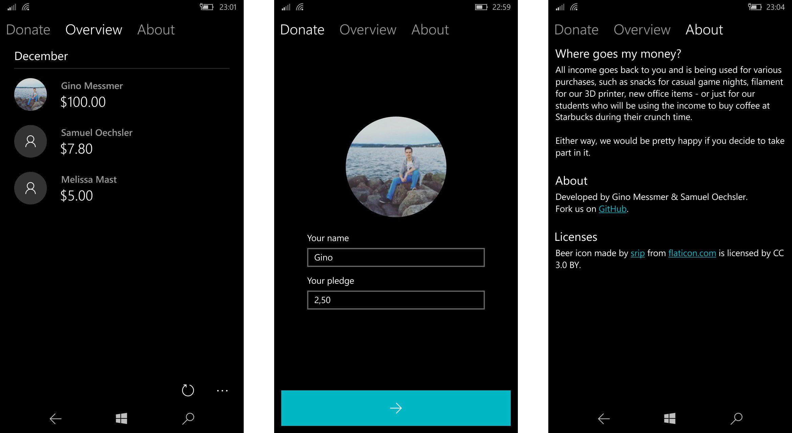

# Doki

Doki (donation kiosk) is a standalone companion app for your lonely piggy-bank and was built for teams who want to keep track of their income.

> This project is currently in WIP and not ready for production yet

## Features

- Submit donations and store them locally (API support coming soon)
- Fill your name from contacts when commiting a new donation
- Support for device's currency and locale
- View leaderboards by month
- Specify general goals for your income

## Requirements

- A device (preferably Windows mobile) that runs **Windows 10 Creators Update** or above
- Piggy-bank and people who are willing to spend a decent amount

## Build and run

Either grab one of the releases or clone the repository to your local machine. Make sure you’ve already installed Visual Studio 2017 and the latest UWP SDKs.

Once you have them, it’s pretty easy to run the app. Just build the app package or deploy it on your device within Visual Studio. Refer [here](https://docs.microsoft.com/en-us/visualstudio/debugger/start-a-debugging-session-for-a-store-app-in-visual-studio-vb-csharp-cpp-and-xaml?view=vs-2017) for assistance.

You may want to configure some settings first. Right click on the `>` button in the “Donate” tab and hit `Settings`. You’ll be asked for your device PIN first. Restart the app after applying your settings to see the changes.